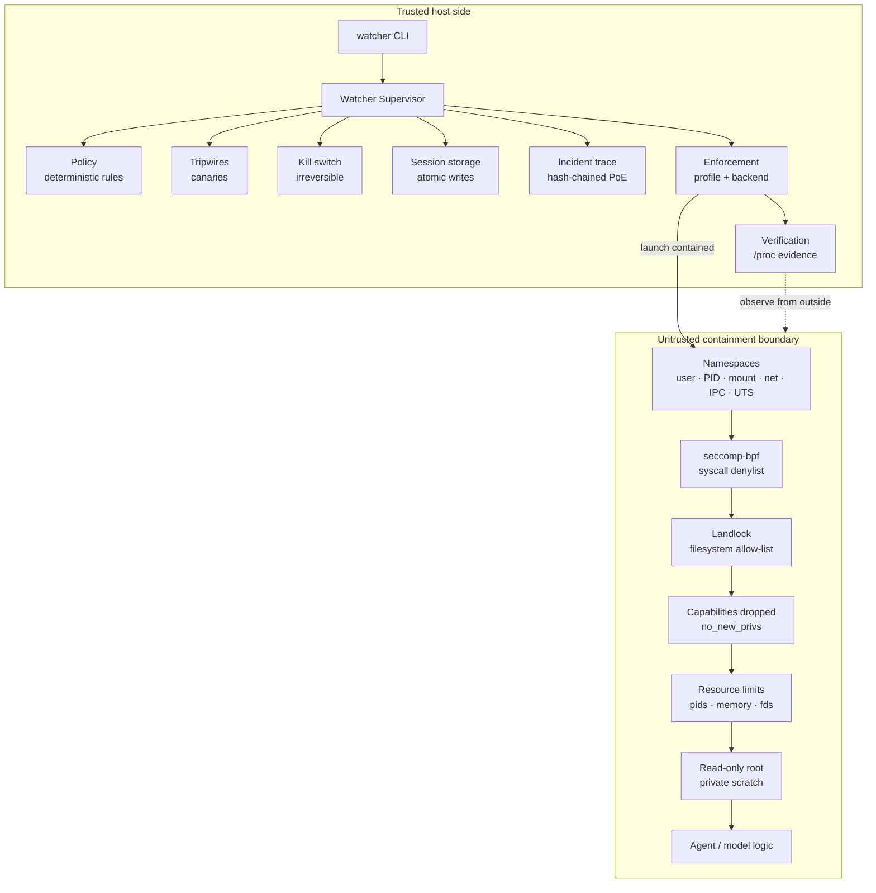

<p align="center">
  
</p>

<h1 align="center">The Watcher</h1>

<p align="center">
  <strong>Runtime observation, Proof of Execution and OS-enforced containment for autonomous AI agents.</strong>
</p>

<p align="center">
  <a href="https://github.com/ladebw/the-watcher/actions/workflows/ci.yml"></a>
  <a href="#install"></a>
  <a href="#license"></a>
  
  
  
  
</p>

---

The Watcher is an experimental runtime security layer for autonomous AI agents.
It records tamper-evident execution traces, enforces deterministic security
policies with no model in the loop, supervises agent processes externally, and
on Linux applies OS-level containment using namespaces, seccomp-bpf, Landlock,
capability dropping and network isolation.

It is independent of any agent framework. It works with arbitrary processes, so
it can wrap a Python agent, a shell script or a compiled binary without the
agent cooperating.

```
Agent
  |
  v
The Watcher
  |
  +-- Observe    every attempted action, before it happens
  +-- Record     append it to a hash-chained Proof of Execution trace
  +-- Enforce    deterministic policy, tripwires, and a kill switch
  +-- Contain    OS-level boundaries the agent cannot step over
  +-- Kill       terminate the process tree and verify it is gone
```

---

## Security Evolution

Three milestones, each moving the trust boundary further away from the agent.

### V1 — in-process observer

```
┌──────────────────────────────┐
│ PROTECTED PROCESS            │
│   agent                      │
│   Watcher  ← same address    │
│   Policy     space           │
│   PoE trace                  │
│   KillSwitch                 │
└──────────────────────────────┘
```

**What it provides:** Proof of Execution, deterministic policy evaluation,
tripwires, and a kill switch. Useful for embedding and for instrumenting
tool calls.

**Limitation:** the Watcher shared the agent's trust boundary. Anything that
could corrupt or disable the agent could corrupt or disable the Watcher along
with the trace it was writing.

### V2 — external supervisor

```
┌──────────────────────────────┐
│ TRUSTED HOST SIDE            │
│   Watcher Supervisor         │
│     Policy   Tripwires       │
│     PoE      Kill switch     │
│     Process control          │
└───────────┬──────────────────┘
            │  authenticated local IPC
            │  (named pipe / Unix socket)
┌───────────▼──────────────────┐
│ PROTECTED PROCESS (untrusted)│
│   thin WatcherClient         │
│   agent / model logic        │
└──────────────────────────────┘
```

**What it provides:** an external supervisor that owns policy, the authoritative
trace, storage and the kill switch; authenticated IPC over a local endpoint;
process-tree termination; fail-closed behaviour when the supervisor is
unreachable; and traces written outside the protected process's reach.

**Limitation:** `DENY` was still an *answer*. A process that ignored the client,
or that never called it and issued syscalls directly, was not stopped. V2 could
observe and record; it could not prevent.

**V2 does not provide containment.** Its boundaries are cooperative: they hold
only for a process that asks. V2's own traces, policy and kill switch live
outside the agent, but the agent's *actions* do not. That gap is precisely what
V3 exists to close, and it is why the two are described separately here rather
than as one thing.

### V3 — OS-enforced containment

```
┌──────────────────────────────┐
│ TRUSTED HOST SIDE            │
│   Watcher Supervisor         │
│     Policy · PoE · Kill      │
│     Enforcement              │
└───────────┬──────────────────┘
            │  unshare + guard
┌───────────▼──────────────────┐
│ CONTAINED PROCESS (untrusted)│
│   namespaces                 │
│   seccomp-bpf                │
│   Landlock                   │
│   no capabilities            │
│   agent / model logic        │
└──────────────────────────────┘
```

**What it provides:** user, PID, mount, network, IPC and UTS namespaces; a
seccomp-bpf syscall denylist; a Landlock filesystem allow-list; a fully cleared
capability set and bounding set; `no_new_privs`; a read-only root filesystem; a
private scratch tmpfs; resource limits; and external verification that the
containment unit is empty after termination.

**The point:**

```
V2:  DENY was a decision.
V3:  DENY becomes an OS-enforced boundary.
```

An agent that never imports `WatcherClient`, never opens the IPC socket and
never asks permission still cannot read `/etc/shadow`, reach the network, call
`mount` or `unshare`, or fork without limit. The kernel refuses, not the
Watcher. Section [Measured Results](#measured-results) shows the numbers.

---

## Architecture



Two properties hold in V3 and are worth stating explicitly:

1. **The Watcher is outside the containment unit.** The supervisor builds the
   sandbox, holds the process handle, and is never reachable from inside it.
   It verifies the sandbox by reading `/proc` from the outside, never by asking
   the workload.
2. **The guard is standalone.** The in-sandbox launcher is four copies of
   standard-library-only modules. It imports nothing from `the_watcher`, so the
   protected environment is never handed the supervisor's source, configuration
   or storage. Two tests enforce this at the AST level.

---

## Proof of Execution

Every session produces an ordered, canonical, hash-chained trace.

```
EVENT 000 ──hash──▶ EVENT 001 ──hash──▶ EVENT 002 ──hash──▶ final_hash
     ▲
 GENESIS_HASH ("0" × 64)
```

Each event's hash covers its content **and** its predecessor's hash, so the
chain is only valid as a whole:

```
Event 1
   ↓ hash
Event 2
   ↓ hash
Event 3
   ↓ hash
Kill / termination
   ↓
Final sealed trace
```

* **Ordered** — a dense sequence with no gaps.
* **Canonical** — deterministic JSON serialisation (sorted keys, tight
  separators, ASCII), so the same content always hashes identically.
* **Chained** — modifying, deleting, inserting or reordering an event breaks
  verification at that point and at every point after it.
* **Tamper-evident, not tamper-proof** — a full consistent rewrite is
  undetectable unless the sealed final hash is published elsewhere. Sealing
  makes *truncation* and *tail edits* detectable; anchoring is what would close
  the rewrite gap, and it is not implemented.
* **Owned outside the agent** — in V2 and V3 the trace is written by the
  supervisor and stored where the protected process cannot reach it.

The verifier reports specific signals rather than a boolean: invalid event hash,
broken link, duplicate hash, out-of-order sequence, truncated chain, invalid
final hash, and so on.

This is a Merkle-style hash chain in the ordinary sense. It is **not** a
blockchain: no consensus, no distributed ledger, no immutability guarantee
against an attacker who owns the storage.

---

## Stack

### Core

* **Python** — 3.10 or newer
* **Standard library only** — `dependencies = []`, asserted by a test
* **SHA-256** — event and trace hashing
* **Canonical JSON** — deterministic serialisation (sorted keys, tight
  separators, ASCII, floats normalised)

### Runtime supervision

* `subprocess`, process groups, `start_new_session` / `CREATE_NEW_PROCESS_GROUP`
* Authenticated local IPC over `multiprocessing.connection` framing
* Windows **Named Pipes** (`AF_PIPE`) and POSIX **Unix domain sockets**
  (`AF_UNIX`), `send_bytes`/`recv_bytes` — never pickle
* `/proc` introspection on Linux, `taskkill /T` on Windows

### Linux containment

* Linux **user namespaces** (`--map-root-user`), **PID**, **mount**,
  **network**, **IPC** and **UTS** namespaces
* **seccomp-bpf** — hand-assembled BPF program, no libseccomp dependency
* **Landlock** — path-based allow-list, ABI-aware access masks
* **Linux capabilities** — `capset` to zero plus bounding-set drop
* **`no_new_privs`**
* **rlimits** — `NPROC`, `AS`, `NOFILE`, `FSIZE`, `CORE`, `STACK`, `CPU`
* **`/proc` inspection** — namespace inodes, capability masks, seccomp mode,
  signal masks, process states, `/proc/<pid>/net/*`

### Validation

* **pytest** — 460 tests passing on Windows, more on Linux where the V3 suite runs
* **Ruff** — lint, clean

### Optional backend

* **Docker** — implemented but **experimental and unverified**. Docker is not
  installed on the development host, so `watcher doctor` reports it unavailable
  and no claim is made that it works. It refuses every configuration it cannot
  guarantee.

---

## Measured Results

> Results below come from the current WSL2 development environment
> (kernel 6.6.87.2-microsoft-standard-WSL2, Python 3.12.3, `namespaces`
> backend, Landlock ABI 3). They are measurements of one machine, not
> performance guarantees, and they are reproducible with the commands in
> [Benchmarks](#benchmarks).

### What V3 stops that V2 did not

The same adversarial agent, which never imports `WatcherClient` and never opens
the IPC socket, run twice:

| Attempt group | V2 (supervisor) | V3 (contained) |
| --- | --- | --- |
| Filesystem | **3 escaped** | 0 of 8 |
| Network | **5 escaped** | 0 of 6 |
| Syscalls | not run unprotected | 0 of 16 |
| Process limits | not run unprotected | 0 of 3 |
| Writes outside the workspace | not run unprotected | 0 of 10 |
| Namespace escapes | not run unprotected | 0 of 9 |

**V2 let 8 forbidden operations through. V3 allowed 0 across 38 attempts.**

The destructive groups were only run contained. Running them against an
unprotected host would have written to `/etc`, deleted `/etc/hosts` and forked
without limit, which is itself the difference being measured.

### Containment cost

| Stage | Median |
| --- | --- |
| Prepare (validate + select backend) | 0.58 ms |
| Launch (namespaces, mounts, Landlock, seccomp, caps, rlimits) | 313 ms |
| Inspect (evidence from `/proc`) | 2.3 ms |
| Isolate → terminate → verify empty | 175 ms |
| **Session setup overhead** | **~490 ms** |

Paid once per session, not once per operation.

### Kill latency

| Metric | Value |
| --- | --- |
| Isolate → terminate → verify empty | **171 ms median** |
| Verified empty | 6 / 6 sessions |
| Survivors | none |

---

## Enforcement Evidence

What the supervisor observed from *outside* the sandbox, not what the workload
claimed. Every row below is asserted by the test suite.

| Protection | Observed evidence |
| --- | --- |
| seccomp-bpf | active — `/proc/<pid>/status` reports `Seccomp: 2`; 48 syscalls blocked |
| Landlock | active where supported — ABI 3, 22 granted paths, `EACCES` on unlisted paths |
| capabilities | dropped — `CapEff` and `CapBnd` both `0000000000000000`; regain returns `EPERM` |
| `no_new_privs` | enabled — `/proc/<pid>/status` reports `1`; clearing it is rejected |
| user namespace | isolated — namespace inode differs from the supervisor's |
| process namespace | isolated — `/proc` contains exactly one PID, `NSpid: 1` |
| mount namespace | isolated — namespace inode differs |
| network namespace | isolated — inode differs, only `lo` present, no route, `ENETUNREACH` |
| root filesystem | read-only — `EROFS` on `/etc`, `/usr`, `/` |
| resource limits | applied — `RLIMIT_NPROC/AS/NOFILE/FSIZE/CORE/STACK`; a fork bomb stops with `EAGAIN` |
| kill verification | verified empty — no process carrying the unit's namespaces remains |

---

## Install

```bash
git clone git@github.com:ladebw/the-watcher.git
cd the-watcher
pip install -e ".[dev]"
```

No runtime dependencies. The `dev` extra installs pytest only.

```bash
watcher --version      # watcher 0.3.0
watcher doctor         # what this host can enforce
```

Without installing, every command below also works as
`python -m the_watcher.cli …`.

---

## Usage

### Check what this host can enforce

```bash
watcher doctor
watcher doctor --json
```

`doctor` probes the host rather than guessing: it forks a child that actually
installs a seccomp filter and creates a user namespace, and it reports which
backends are usable. Exit code `0` means enforcement is available, `1` means it
is not. Use `--workspace DIR` to also check whether Landlock can reach a
specific workspace on this filesystem.

### V2 — external supervisor

```bash
watcher run -- python my_agent.py

watcher run --allow-domain github.com \
            --trace-out traces/session.json \
            --timeout 30 \
            --fail-closed \
            -- python my_agent.py
```

### V3 — OS-enforced containment (Linux)

```bash
watcher run --enforced -- python my_agent.py

# strictly no egress, bounded resources
watcher run --enforced --network none -- python my_agent.py

# explicit ceilings and an explicit profile
watcher run --enforced --memory 512 --pids 32 --cpus 1.0 -- python my_agent.py
watcher run --enforced --containment-profile research-strict -- python my_agent.py
watcher run --enforced --containment-profile ./profiles/strict.json -- python my_agent.py
```

### Inspect what happened

```bash
watcher status <session-id>
watcher verify traces/session.json
watcher verify traces/session.json --quiet   # exit code only

watcher demo          # in-process walkthrough
watcher demo --v2     # external-supervisor walkthrough
```

### V1 — in-process

```bash
watcher run --inline -- python agent.py
```

### Exit codes

| Code | Meaning |
| --- | --- |
| *action's own* | the protected process exited normally |
| `124` | session timed out in `--inline` mode |
| `137` | the kill switch was engaged |
| `78` | `--enforced` was requested and containment could not be applied — **the command was never run** |

---

## Example

The intended interface is the CLI, because The Watcher should work with any
agent or process, cooperative or not:

```bash
watcher run --enforced --workspace /srv/agent-ws -- python my_agent.py
```

What happens:

1. The supervisor validates the containment profile and selects a backend,
   failing closed if the host cannot enforce it.
2. It builds the sandbox — namespaces, mounts, Landlock allow-list, seccomp
   filter, capability drop, `no_new_privs`, resource limits — *before* the agent
   executes a single instruction.
3. The agent runs inside that boundary. Any attempt to leave it fails with an
   OS errno, whether or not the agent cooperates.
4. Every decision and lifecycle event is appended to the hash-chained trace,
   with the containment profile digest recorded alongside it.
5. On a critical violation the supervisor isolates the unit, terminates it,
   verifies from outside that nothing survives, and seals the trace.

---

## Containment Profiles

A profile describes what the sandbox allows. It is validated before anything
starts, and its SHA-256 digest is recorded in the trace so the record proves
which containment was in force.

```bash
watcher run --enforced --containment-profile research-strict -- python3 agent.py
watcher run --enforced --network none --memory 512 --pids 32 -- python3 agent.py
```

Built-in presets:

| Preset | Network | Root | Purpose |
| --- | --- | --- | --- |
| `research-strict` | none | read-only | the default; no egress, minimum privilege |
| `research-net` | restricted | read-only | same, with an allow-listed network |
| `dev` | open | writable | development; reported as reduced protection |

Three settings are refused outright rather than adjusted: `allow_privileged`,
`allow_docker_socket`, and dangerous capabilities without an explicit research
override. A profile file with an unknown key is rejected too — a typo must not
silently leave a default in force. Profiles that weaken the baseline are
flagged as reduced protection and recorded as such.

---

## Policies, Tripwires and Host Signals

**Policy.** Deterministic ordered rules over filesystem paths, network domains,
tool names, environment variables and process counts. Four decisions, and only
four:

| Decision | Meaning |
| --- | --- |
| `ALLOW` | the action may proceed |
| `DENY` | refused now; the session may continue |
| `QUARANTINE` | refused and the session flagged; a second blocked action escalates to `KILL` |
| `KILL` | the process tree is terminated and every later action is refused |

No model participates in a decision.

**Tripwires.** Named canaries for things that should never be touched — cloud
metadata endpoints, credential stores, container sockets, `/proc/*/mem`, and so
on. A tripwire match is a `KILL`, not a `DENY`.

**Host signals.** A fixed vocabulary mapping observed host conditions to
responses, so the supervisor's reaction to (for example) a sandbox-escape
attempt is defined in advance rather than improvised.

**Redaction.** Secrets never reach the trace: redaction is applied before the
event is hashed, by field name (`api_key`, `authorization`, `token`,
`password`, `secret`, `private_key`, `cookie`, `session_id`, …) and by value
shape (provider key prefixes, JWTs, PEM blocks, `Bearer` headers, URL
userinfo).

---

## How V2 Keeps the Boundary

* **Authoritative evaluation.** A client cannot supply `sequence`, `timestamp`,
  `previous_hash`, `event_hash`, `final_hash`, `decision` or `risk`. If it
  tries, the fields are stripped, the attempt is recorded, and the daemon's own
  verdict is used.
* **Transport.** Local only — a named pipe on Windows, a Unix domain socket on
  POSIX. No TCP transport exists. Frames are length-prefixed JSON, never pickle.
* **Authentication.** A per-session `secrets.token_urlsafe(32)` token, a
  handshake that must happen before anything else, replay protection, connection
  limits, and allow-listed client metadata.
* **Environment.** Every `WATCHER_*` variable is stripped from the inherited
  environment before the child is launched; only connection details are added
  back, last, so they cannot be overridden. Policy configuration, storage paths
  and tripwire definitions never reach the child.
* **Failure modes.** If the supervisor becomes unreachable the client fails
  closed by default. Heartbeat loss and IPC loss are detected and can be
  configured to record, quarantine or kill.
* **Kill authority.** The kill decision and the termination both happen outside
  the protected process, and the kill state is irreversible — the client cannot
  reset it over IPC.

---

## Threat Model

The Watcher assumes the protected process may be:

* buggy
* compromised
* uncooperative
* actively trying to bypass voluntary client-side checks

It therefore treats all of the following as **untrusted input**:

* the agent process and everything it emits
* model output of any kind
* IPC input on the control channel
* tool requests and their arguments
* event metadata

Correspondingly, the trusted computing base is: the supervisor process, the
policy and profile configuration, and — in V3 — the host kernel.

---

## Limitations

The Watcher does **not** guarantee:

* perfect containment of an AI system
* protection from unknown kernel vulnerabilities
* protection from a same-user compromise of the host
* prevention of covert channels (timing, cache, microarchitectural)
* hardware-level or VM-grade isolation
* anything resembling AGI safety

Platform and implementation limits, stated plainly:

* **V3 is Linux-only.** On native Windows, V1 and V2 remain available and
  `--enforced` refuses rather than degrading. `watcher doctor` says so.
* **V3 needs a Linux-native workspace.** Landlock path rules are not reliably
  honoured on 9p/drvfs/CIFS-style filesystems, so a WSL `/mnt/c` workspace is
  refused. See [`diagnostics/README.md`](diagnostics/README.md) for the
  measurement behind that decision.
* **`network=restricted` is not implemented for the rootless backend.** Partial
  egress control needs host network privileges; the profile is refused rather
  than approximated.
* **The Docker backend is unverified.** Implemented conservatively, refuses
  everything it cannot guarantee, never exercised on this project's development
  host.
* **A PID-namespace init cannot be terminated gracefully.** The kernel sets
  `SIGNAL_UNKILLABLE` on it, so a default-disposition `SIGTERM` is discarded and
  only `SIGKILL` gets through. The supervisor reads the target's signal mask and
  bounds the grace period accordingly.
* **`RLIMIT_NPROC` is per-uid and host-wide.** It is set to a measured baseline
  plus the configured budget, and both numbers are recorded. Memory is bounded
  with `RLIMIT_AS` (address space), not cgroup RSS; cgroups are not delegated.
* **The IPC socket is mounted read-write** into the sandbox, because
  `connect()` to an `AF_UNIX` socket requires write permission. The workload can
  delete it and break its own control channel; it cannot impersonate the
  supervisor.
* **Three PoE defects were found and fixed while preparing CI** — one stamped
  event timestamps outside the lock that orders appends, one let a late
  `stop()` append after the trace had been sealed, and one let a host clock step
  be read as reordering. All three made a valid, untampered trace verify as
  **tampered**, as `TIMESTAMP_REGRESSION` or `INVALID_FINAL_TRACE_HASH`. A
  sealed trace now refuses further appends outright, timestamps cannot go
  backwards within a trace, a backwards clock step is recorded as
  `clock_regression` evidence rather than discarded, and all three have
  deterministic regression tests. See [Development Notes](#development-notes).

---

## Security Principles

```
Do not trust the model.
Do not trust the client.
Keep policy outside the agent.
Keep PoE outside the agent.
Fail closed when enforcement cannot be established.
Record what happened.
Verify the workload is actually gone after kill.
```

---

## Benchmarks

```bash
python benchmarks/benchmark_v2.py            # writes benchmark-results.json
python benchmarks/benchmark_v2.py --quick

python benchmarks/benchmark_v3.py            # writes benchmark-v3-results.json
python benchmarks/benchmark_v3.py --quick
```

`benchmark_v2.py` measures canonical-hash cost, policy evaluation, PoE append,
IPC round-trip latency, sequential and concurrent throughput, and
kill-decision → process-tree-terminated latency, reporting median / mean /
p95 / p99.

`benchmark_v3.py` measures containment lifecycle cost and kill latency, and
runs the same adversarial agent under V2 and V3 to count what each lets
through. On a host without a containment backend it reports that and measures
nothing, rather than printing numbers that mean nothing.

Print the headline numbers from a saved run:

```bash
python diagnostics/show_benchmark.py benchmark-v3-results.json
```

Diagnostics that measure the platform itself are documented in
[`diagnostics/README.md`](diagnostics/README.md).

---

## Testing

```bash
python -m pytest
python -m ruff check .
```

Current status:

| Platform | Result |
| --- | --- |
| Windows (Python 3.14) | **460 passed, 61 skipped** |
| Linux / WSL2 (Python 3.12) | **519 passed, 2 skipped** |

`tests/test_v3_containment.py` is the only module that needs OS-enforced
containment, so it carries the `v3` marker and the cross-platform matrix
deselects it rather than running it somewhere it cannot pass:

```bash
python -m pytest                # everything this host can attempt
python -m pytest -m "not v3"    # the cross-platform matrix
python -m pytest -m v3          # the Linux-only containment suite
```

Under `-m v3` on Windows the suite skips, and says why rather than passing
silently:

```
V3 OS-enforced containment requires Linux with user namespaces and seccomp;
this is win32. V2 external supervision remains available here.
```

The suite is green on both platforms. Three PoE defects, one test-side timing
budget and one deadlock-prone test were found while preparing CI and are now
fixed, each with a regression test; see [Limitations](#limitations) and
[Development Notes](#development-notes). No retry and no `continue-on-error` is
used anywhere, so an intermittent failure shows up as a red run.

To run the full suite including the Linux-only containment tests:

```bash
bash diagnostics/run_tests_linux.sh
bash diagnostics/final_check.sh      # tests, doctor, containment, refusal, V2
```

CI (`.github/workflows/ci.yml`) mirrors that split. `quality` runs the lint,
hygiene and secret scans. `tests` runs `python -m pytest -m "not v3"` across
Linux and Windows on Python 3.10, 3.12 and 3.14 — deliberately not the
containment suite, because on `ubuntu-latest` (24.04) the namespace backend is
unavailable and selection falls back to Docker, which cannot start a container
with the privileges that job does not take. `v3-containment` owns containment
exclusively, on `ubuntu-22.04`, and **fails closed**: if the runner cannot
enforce containment, `doctor` fails the job rather than letting it pass without
having exercised anything. Every job has a bounded `timeout-minutes`, so a hang
fails the check instead of burning an hour of runner time. There are **no
retries and no `continue-on-error`**, so an intermittent failure shows up as a
red run rather than being smoothed over.

The suite covers:

* **V1** — allowed actions, event ordering, hash chaining, tamper detection
  (modification, deletion, insertion, reordering), forbidden file access,
  unauthorized network access, tripwire kills, kill-blocking, process
  termination including children, redaction, standalone operation.
* **V2 protocol and transport** — malformed JSON, invalid UTF-8, NUL bytes,
  unpaired surrogates, NaN/Infinity, oversized frames, excessive nesting,
  oversized strings, unexpected envelope keys, unsupported protocol versions,
  and the absence of any TCP transport or pickle usage.
* **V2 authentication** — correct/wrong/missing/non-ASCII tokens, session
  mismatch, handshake ordering, connection limits, request replays, client
  metadata allow-listing.
* **V2 authority** — a client cannot supply authoritative fields, and the
  attempt is recorded.
* **V2 lifecycle** — startup ordering, valid IPC configuration reaching the
  child, supervisor internals never reaching it, `COMPLETED`/`FAILED`/`KILLED`
  outcomes, session timeout, heartbeat loss, IPC loss, storage failure, a
  crashing child not crashing the supervisor.
* **V2 kill authority** — external trigger, tree termination, irreversibility,
  trace validity, and no reset through IPC.
* **V2 concurrency** — dense duplicate-free sequences under load, no duplicate
  event hashes, and the kill-race invariant.
* **V3 containment** — a bypass agent stopped on filesystem access, network
  egress, forbidden syscalls, capability regain, `no_new_privs` clearing,
  symlink and hardlink escapes, `..` traversal, `/proc/self/root`, open-fd
  paths, `setns`, `open_by_handle_at` and fork bombs; plus structural
  assertions read from `/proc` outside the sandbox.
* **V3 fail-closed** — enforced mode refuses on an incapable host, an explicit
  unavailable backend raises, an unverifiable sandbox is destroyed rather than
  trusted, an uncontainable workspace is refused, and `KILL_FAILED` is recorded
  as critical.
* **Packaging** — version agreement between code and metadata, the
  zero-dependency promise, the console script, README asset paths, no
  user-specific paths in published files, and the guard's independence from the
  package.

---

## Project Structure

```
the_watcher/
├── cli.py            watcher run / status / verify / demo / doctor
├── exceptions.py
├── poe/              Proof of Execution
│   ├── canonical.py  deterministic serialisation
│   ├── event.py      immutable hash-chained event
│   ├── trace.py      ordered trace, final hash, seal
│   ├── recorder.py   single write path, redaction, locks
│   ├── redact.py     secret redaction
│   └── verifier.py   tamper detection
├── watcher/          policy, tripwires, kill switch, V1 API
├── ipc/              V2 transport: protocol, transport, server, client
├── supervisor/       V2/V3 trusted side: daemon, session, storage, process
├── enforcement/      V3 OS-enforced containment
│   ├── profile.py        containment profile + presets + digest
│   ├── capabilities.py   what this host can actually enforce (probed)
│   ├── procfs.py         trusted-side observation via /proc
│   ├── base.py           enforcer contract, states, evidence
│   ├── backends/         namespaces, docker
│   └── linux/            stdlib-only kernel primitives + in-sandbox guard
└── runtime/          process handling and tree termination

tests/                  V1, V2, V3 and packaging suites
examples/               runnable demonstrations
benchmarks/             benchmark_v2.py, benchmark_v3.py
diagnostics/            platform probes and release-hygiene checks
public/                 project assets
```

---

## Research Status

The Watcher is experimental research software, published so the approach can be
inspected, reproduced and criticised.

```
V1 ✅  PoE + Policy + Kill Switch
V2 ✅  External Supervisor + authenticated IPC
V3 ✅  OS-Enforced Containment (Linux)
V4 🔜  Dynamic control and adversarial benchmark research
```

V4 is **not started**. Nothing in this repository implements it, and nothing
above describes it as if it exists. What V3 leaves open is listed under
[Limitations](#limitations).

Known open work:

* an in-sandbox init stub that forwards signals and reaps zombies, so teardown
  can be graceful and long-running sandboxes do not accumulate zombies
* cgroup delegation for real `pids.max` / `memory.max` rather than uid-wide
  `RLIMIT_NPROC` and address-space limits
* a `SECCOMP_RET_USER_NOTIF` broker, which is what would make per-call
  allow-listing possible
* an egress allow-list, to make `network=restricted` real
* anchoring the sealed trace hash externally, to close the full-rewrite gap
* verification of the Docker backend on a host that has Docker

---

## Development Notes

**Three PoE defects found while preparing CI, all fixed.** `test_v2_concurrency.py`
and `test_child_processes_are_terminated_with_the_tree` failed intermittently —
roughly one run in five under load, on Linux and on Windows. They were written
off as "timing flakes" at first, which was wrong: the tests were right and the
PoE was not. Each is fixed, with a regression test.

* **Non-monotonic timestamps.** `Recorder.record()` stamped
  `timestamp=int(self._clock())` *before* taking the lock that orders appends,
  so two threads straddling a whole-second boundary could be appended in the
  opposite order to the one they were stamped in. The hash chain stayed intact
  while verification reported `TIMESTAMP_REGRESSION` — a false tamper verdict on
  a legitimate trace. The timestamp is now taken inside the same critical
  section that assigns the sequence number, so sequence, timestamp and chain
  link all derive from one serialised append. Reproduced deterministically
  against `Recorder` alone; the regression test fails on the old code.

* **Writes after the seal.** `WatcherDaemon.stop()` and `_finalize()` were not
  mutually exclusive. `stop()` tested `_finalised` without synchronisation, so
  it could pass that test and then append a `kill_switch` event while the daemon
  thread was sealing the trace. The append landed after the seal, changing the
  event count and head hash, so `compute_final_hash()` no longer matched
  `declared_final_hash` and verification reported `INVALID_FINAL_TRACE_HASH` on
  an untampered trace. Finalisation now claims the daemon lock before doing
  anything else and sets a shutdown flag there; `stop()` checks that flag under
  the same lock. A kill therefore either lands before finalisation begins — and
  is part of the sealed trace — or is skipped entirely. There is no interleaving
  in which it lands after the seal.

* **A host clock step read as reordering.** Event timestamps come from
  `time.time()`, which steps backwards when the host resynchronises its clock:
  NTP, a VM resuming, or WSL2 catching up with Windows. Verification reads a
  decreasing timestamp as evidence of a reorder, so a clock step produced
  `TIMESTAMP_REGRESSION` on a trace nobody had touched. Measured on the
  development host: one step of **-1.23 s** in 9,698 samples over 200 s, which
  was enough to fail a concurrency run.

  `ExecutionTrace.append()` now keeps the authoritative timestamp
  non-decreasing — which is the property the verifier actually checks — **and
  records the anomaly rather than swallowing it**. The event that would have
  gone backwards carries a `clock_regression` block in its `metadata`:

  ```json
  "clock_regression": {
    "raw_timestamp": 1000,
    "previous_timestamp": 1001,
    "delta_seconds": 1
  }
  ```

  The raw reading, the timestamp it clashed with and the size of the step all
  survive, and because metadata is part of the event hash the evidence is
  itself tamper-evident. The key is **owned by the trace**: anything a caller
  supplies under it is removed before the event is appended.

  Scoped precisely: the reserved `clock_regression` metadata cannot be supplied
  by an untrusted agent or client in the authoritative runtime path.
  Authoritative timestamps are assigned server-side — `AUTHORITATIVE_FIELDS`
  strips `timestamp` (along with `sequence`, `previous_hash`, `event_hash`,
  `final_hash`, `decision` and `risk`) from client payloads, recursively, and
  `Recorder.record()` takes no timestamp argument at all, so the value it
  stamps can only come from the daemon's own clock. A caller with in-process
  access can still hand an arbitrary `timestamp` to the internal
  `ExecutionTrace.append()` / `.add()` APIs and thereby induce a record; that
  is an embedder path, not the client path, and the evidence would still
  truthfully report the value it was given.

  `trace.clock_regressions` lists every step observed, in append order, and is
  empty for an ordinary session.

  This does not blunt the reorder signal: reordering happens to events *after*
  they were appended, so a swap still produces a decrease and is still reported
  as `TIMESTAMP_REGRESSION`.

Three further changes came out of the same investigation:

* an execution trace now **refuses** an append once sealed (`TraceSealedError`)
  instead of accepting it and letting the declared hash drift. This is defence
  in depth: a writer that outlived shutdown cannot alter the audit trail even if
  every other guarantee failed.
* `IpcServer` has an explicit `RUNNING → DRAINING → STOPPED` lifecycle and
  counts the handlers currently inside `dispatch`. Draining refuses to *start* a
  new authoritative write, waits for the ones in flight and for the worker
  threads that own them, and a drain that does not finish raises
  `IpcDrainTimeout` rather than returning quietly. This closes a separate latent
  weakness: the join used to give up at its deadline while the comment above it
  claimed no worker could still append.
* the supervisor drains IPC writers before recording the final lifecycle events
  and sealing, and verifies the sealed trace before writing it out.

**A Windows IPC test could deadlock the whole run.**
`test_receiver_refuses_an_oversized_frame_without_crashing` sent a 20 KB frame
into a pipe whose reader had not read yet. On Windows that write is an overlapped
`WriteFile` that waits forever once the pipe fills, and the reader refuses the
frame on its length prefix without draining the body — so the writer could never
finish. It hung CI for 1 h 35 m on Python 3.10 and 3.12; 3.14 happened not to
block. The frame now exceeds the receiver's limit by more than 2x while fitting
inside the pipe buffer, so the send always completes and the assertion is
unchanged. `test_ipc_auth.py`'s protocol-violation test had the same shape and is
now driven by a separate, bounded adversarial peer process
(`tests/agents/malformed_sender.py`): a malformed client is allowed to wedge
itself, the test is not. The authoritative assertion in both cases is on the
server — it must detect and report the violation and drop the connection.

**One test-side timing budget was also wrong.** The heartbeat test passed only
when the child booted, connected and authenticated in under 1.4 s
(`session_timeout=2.0` minus `heartbeat_timeout=0.6`), because the session
timeout is measured from process spawn while the heartbeat clock starts at IPC
authentication. On a slower or loaded host the session timeout won and no
`heartbeat_lost` was ever recorded. The test now waits for the recorded
`client_authenticated` event before asserting anything, and gives the session
timeout enough headroom that it cannot beat the heartbeat timeout, so it
measures heartbeat behaviour rather than host speed. It also asserts the
ordering it depends on. No assertion was weakened and no retry was added.

Verification of the fixes, all with no retries: the 100-round concurrent-ordering
test repeated 15 times (1,500 rounds) with 0 `TIMESTAMP_REGRESSION`; the
concurrency suite 30 times consecutively with 0 failures; the repaired
protocol-violation test 50 times on Windows with 0 hangs and 0 failures; the four
IPC modules 20 times with 0 failures; the heartbeat tests 20 times on Windows and
20 times on Linux with 0 failures. Before the fixes the concurrency suite was
failing around 1 run in 4.

**One V2 defect was found and fixed during V3 validation.** `IPC_LOST` was never
recorded when a client died without disconnecting, because the supervisor's poll
of the child won the race against the IPC server noticing the closed socket on
Linux. The supervisor now records it from the child's exit, which is a
trustworthy signal that the client is gone.

**Platform findings are measured, not assumed.** Three decisions in the Linux
enforcement layer came from probes rather than documentation, and the probes are
kept in [`diagnostics/`](diagnostics/README.md) so the reasoning stays
checkable:

* `--map-root-user` is required to build a mount tree, and uid 0 inside it is
  namespace-local — so both uids are recorded and no "non-root" claim is made;
* `READ_DIR` is rejected for regular files, so allow-list masks are narrowed per
  object type;
* Landlock path rules are not reliably honoured on 9p/drvfs, so such a workspace
  is refused by filesystem type rather than probed.

---

## Provenance

The Watcher is an independent project. It shares no code, no data structures and
no runtime dependency with AAIP, and it contains no agent identity, signatures,
validators, distributed ledger or economic layer. The Proof of Execution
concept originated in earlier work on auditable agent execution; this
implementation stands alone.

---

## License

MIT. See [LICENSE](LICENSE).
